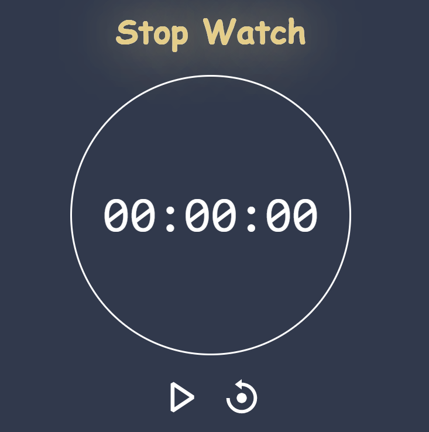
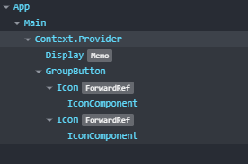

# STOPWATCH

## Requirement

[](https://img.shields.io/badge/react-%5E18.2.0-green)
[](https://img.shields.io/badge/node-%5E14.17.6-green)
[](https://img.shields.io/badge/typescript-%5E4.7.4-green)
[](https://img.shields.io/badge/eslint-%5E8.20.0-green)
[](https://img.shields.io/badge/prettier-%5E2.7.1-green)
[](https://img.shields.io/badge/platform-window%20%7C%20linux-green)


## Introduction

Design a stopwatch 24-hours with 6-digits, and 2 buttons `Start/Stop` and `Reset`
	
In the beginning, the clock should display `00:00:00` and the buttons should have `Start` and `Reset` buttons.

When user click on `Start` button the clock will start to count and the `Start` button should change to `Stop` button and the clock will auto increase on next unit at its end.

For example:

- Next of `00:00:59` should be `00:01:00` 
- Next of `00:59:00` should be `01:00:00` 
- Next of `23:59:59` should be `00:00:00`

When user click on `Stop` button the clock will stop at where it is and the `Stop` button should change to `Start` button, when user click on `Start` it will resume counting.

When user click on `Reset` at any point, the clock should stop counting and return to `00:00:00`.

## Setup

Install npm management tool dependencies:

```console
npm install
```

## Available Scripts

In the project directory, you can run:

### `npm start`

Runs the app in the development mode.\
Open [http://localhost:3000](http://localhost:3000) to view it in your browser.

The page will reload when you make changes.
You may also see any lint errors in the console.

### `npm run lint`

Running it will look for problems in the project and bring up the console but won't fix it

### `npm run lint:fix`

Running it will look for problems in the project and fix them. If the problem cannot be fixed, it will show up in the console

### `npm run format`

Running it will call prettier to fix the code style.

## UI



## Data Flow

Component architecture:



Data flow:

- There will be three functions used to update three parameters of hours, minutes and seconds: `updateHour`, `updateMinute`, `updateSecond`
- There will be three functions activated when three buttons start, stop and reset are clicked: `start`, `stop`, `reset`
- There will be a function that helps to update all three parameters to 0: `resetAll`
- `start` will run the `updateSecond` indefinitely.
- `stop` will pause `updateSecond` loop.
- `reset` will stop `updateSecond` loop and update all three parameters to 0.
- When the number of seconds is 60, the `updateMinute` will be run taking on the role of updating minutes plus 1 and seconds to 0.
- Similar to the `updateMinute`. When the number of minutes is 60, the `updateHour` will be run taking on the role of updating hours plus 1 and minutes to 0.
- When the number of hours is 24, the `updateHour` will take on an additional role of updating all three parameters to 0.

## Archive

- Understanding `useState`, `useMemo`, `useCallback` and `useContext` hooks.
- Lifecycle and data flow in react.
- Improve project performance.
- Basic TypeScript understanding.
- Basic knowledge of Git version control management.

## Appendix

[React Typescript](https://create-react-app.dev/docs/adding-typescript/)

[ES6](http://es6-features.org/)

[React Hooks](https://reactjs.org/docs/hooks-intro.html)

[Typescript Handbook](https://www.typescriptlang.org/docs/handbook/intro.html)

[Conventional Commit](https://www.conventionalcommits.org/en/v1.0.0/#specification)
